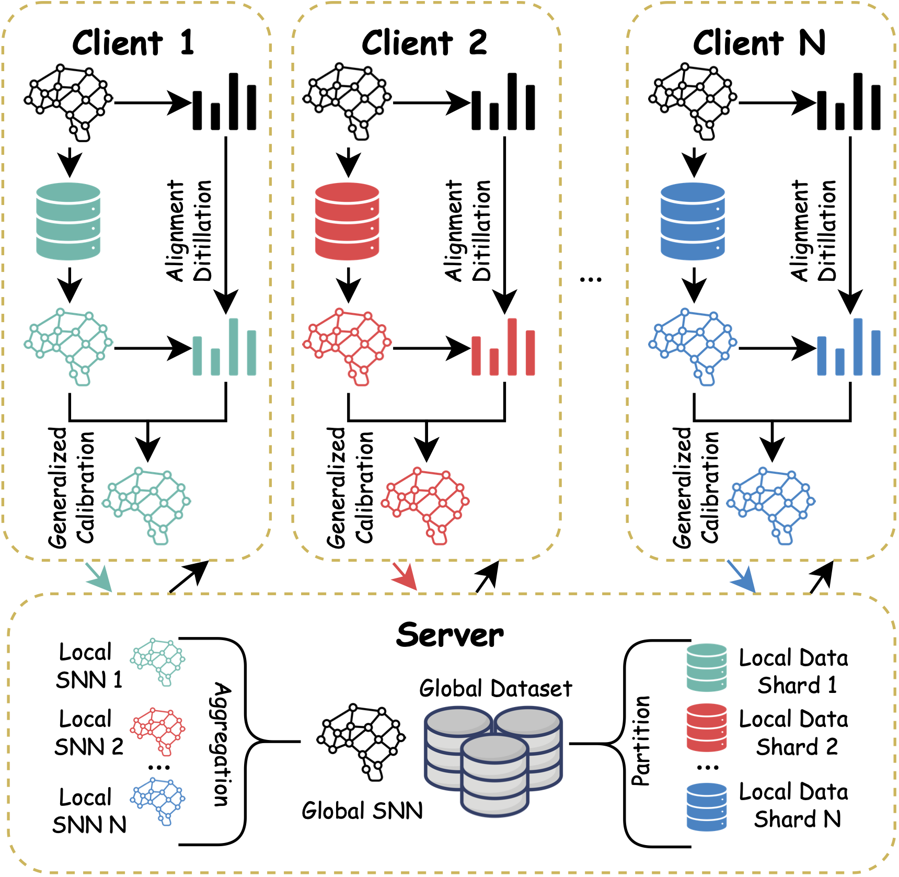

# FedLEC
Official code for "FedLEC: Effective Federated Learning Method Under Extreme Label Skews for Spiking Neural Networks" (AAAI2025)

## Overview
<p align="center">

</p>

## Requirements

```
torch==2.0.1
torchvision==0.15.2
numpy==1.23.5
pandas==1.5.3
scikit-learn==1.2.1
spikingjelly==0.0.0.0.14
```

## Quick Start

```
python main.py -data_dir=. -dataset=cifar10 -model=vgg9 -strategy=fedlec -np=10 -frac=0.2 -gpu=0 -partition=noniid-c-dir -alpha=0.5 -snn -T=4 -desc=Example
```

## Supported Dataset

You can download experiment data and put them into specific data folder manually. 

All data are available in the links below:

- [CIFAR10](https://www.cs.toronto.edu/~kriz/cifar.html)
- [SVHN](http://ufldl.stanford.edu/housenumbers/)
- [CIFAR10-DVS](https://figshare.com/articles/dataset/CIFAR10-DVS_New/4724671)
- [N-MNIST](https://www.garrickorchard.com/datasets/n-mnist)

## Parameter Settings

The paper introduce two types of label skews in federated SNN learning.

- Distribution-based Label Skew $p\sim Dir(a)$

    Try `-partition=noniid-c-dir -alpha=a`, where $a \in (0, 1)$ to control the skewness of Dirichlet sampling for labels.

- Quantity-based Label Skew $\#cnum=c$

    Try `-partition=noniid-cnum-c`, where $c$ represents the number of label types that one data shard could include


For the other arguments descriptions, please reach the apppendix in our paper or find them in `main.py`.

## Cite

Please cite the following paper if you find our work contributes to yours in any way:

```

```
